# 🎯 PardesLine – 3D Computer Vision Tutorials

<div align="center">

[](https://www.youtube.com/@PardesLine26)
[](http://www.open3d.org/)
[](https://www.python.org/)

**Professional tutorials on 3D mesh and point cloud workflows for Computer Vision, Robotics, VR/AR, and Machine Learning**

[📺 Watch Introduction](https://youtu.be/nEOeiYpRc0E?si=59lrWlMWuV5mUj0b) | [🔗 GitHub Repository](https://github.com/1904jonathan/PardesLine)

</div>

---

## 📚 Tutorial Series

Complete step-by-step video tutorials with accompanying Python modules. Each tutorial builds upon previous concepts, creating a comprehensive learning path in 3D computer vision.

| # | 📖 Tutorial Topic | 🐍 Python Module | 🎥 Video Tutorial |
|---|-------------------|------------------|-------------------|
| **Intro** | **Getting Started with 3D Vision** | - | [▶️ Watch](https://youtu.be/nEOeiYpRc0E?si=59lrWlMWuV5mUj0b) |
| **01** | **Point Cloud Processing** | [`01_pointcloud_processing.py`](01_pointcloud_processing.py) | [▶️ Watch](https://youtu.be/D0TlEalWhVI?si=W4Ucj5QEnqMMYH8C) |
| **02** | **Mesh Processing & Operations** | [`02_mesh_processing.py`](02_mesh_processing.py) | [▶️ Watch](https://youtu.be/7PPFEOXewZE?si=T0BCFb9mK3Fl9c5X) |
| **03** | **Mesh & Point Cloud to Volume** | [`03_mesh_pcd_to_volume.py`](03_mesh_pcd_to_volume.py) | [▶️ Watch](https://youtu.be/3OZzJfNn9Ks?si=b77CE6196B0hdLmQ) |
| **04** | **Signed Distance Fields (SDF)** | [`04_SDF.py`](04_SDF.py) | [▶️ Watch](https://youtu.be/Gxmd62wvMJA?si=OHZvCYavUkvSSxCP) |
| **05** | **Surface Reconstruction** | [`05_surface_reconstruction.py`](05_surface_reconstruction.py) | [▶️ Watch](https://youtu.be/aaxzXQsILYs?si=9fpHTCEtwCgI1KjN) |
| **06** | **Point Cloud Registration (RANSAC + ICP)** | [`06_point_cloud_registration.py`](06_point_cloud_registration.py) | [▶️ Watch](https://youtu.be/gv6VWirNH3I?si=tcDY0g4szkI3s87I) |
| **07** | **Deformable Registration (CPD)** | [`07a_deformable_registration.py`](07a_deformable_registration.py) | [▶️ Watch](https://youtu.be/H5HCKN5Iph8?si=iSRxYQTG4Iolfmk4) |
| **08** | **Point Cloud Segmentation (PointNet)** | [`08_point_cloud_segmentation.py`](08_point_cloud_segmentation.py) | 🎬 Coming Soon |

---

## 🎓 What You'll Learn

### Tutorial 01: Point Cloud Processing
- Load and visualize point clouds with Open3D
- Convert meshes to point clouds
- Uniform and Poisson-disk sampling techniques
- 3D visualization and data export
- **Helper Module:** [`functions.py`](functions.py)

### Tutorial 02: Mesh Processing & Operations
- Comprehensive mesh loading and manipulation
- Vertex normal computation
- Mesh coloring techniques
- Mesh subdivision and simplification algorithms
- Quality optimization strategies

### Tutorial 03: Mesh & Point Cloud to Volume
- Voxelization techniques
- AABB/OBB bounding box computation
- Point cloud to volume conversion
- Binary volume visualization
- Erosion operations on volumetric data

### Tutorial 04: Signed Distance Fields (SDF)
- Advanced SDF computation from meshes
- Shell representation creation
- Morphological operations (erosion)
- Mesh reconstruction from SDF volumes
- Configurable pipeline with logging
- **Helper Module:** [`functions_for_sdf.py`](functions_for_sdf.py)

### Tutorial 05: Surface Reconstruction
- Convex Hull computation
- Alpha Shapes with varying alpha values
- Ball Pivoting Algorithm (BPA)
- Poisson Surface Reconstruction
- Normal estimation and orientation
- Density-based filtering
- **Helper Module:** [`functions_for_surfaceR.py`](functions_for_surfaceR.py)

### Tutorial 06: Point Cloud Registration
- RANSAC global registration
- ICP local refinement
- FPFH feature extraction
- Transformation matrix recovery
- Comprehensive error analysis
- Yellow/cyan visualization for alignment
- **Helper Module:** [`functions_for_registration.py`](functions_for_registration.py)

### Tutorial 07: Deformable Registration
- Gaussian process deformation
- Coherent Point Drift (CPD) algorithm
- Control points and kernel interpolation
- Deformation field recovery
- Comprehensive metrics and analysis
- Multi-stage visualization
- **Helper Module:** [`functions_for_deformation.py`](functions_for_deformation.py)

### Tutorial 08: Point Cloud Segmentation ✨ NEW
- PointNet model with OpenVINO
- Deep learning for point cloud segmentation
- Part segmentation (back, seat, legs, arms)
- Color-coded visualization
- PLY export with vertex colors
- **Helper Module:** [`functions_for_segmentation.py`](functions_for_segmentation.py)

---

## 🚀 Quick Start

### Installation

```bash
# Clone the repository
git clone https://github.com/1904jonathan/PardesLine.git
cd PardesLine

# Install dependencies
pip install -r requirements.txt
```

### Requirements

```
open3d       # 3D geometry processing
numpy        # Numerical computing
scipy        # Scientific computing
scikit-image # Image processing
matplotlib   # Plotting and visualization
loguru       # Enhanced logging
pycpd        # Coherent Point Drift
openvino     # OpenVINO inference engine
```

### Running Tutorials

Each module can be run independently:

```bash
python 01_pointcloud_processing.py
python 02_mesh_processing.py
python 03_mesh_pcd_to_volume.py
python 04_SDF.py
python 05_surface_reconstruction.py
python 06_point_cloud_registration.py
python 07a_deformable_registration.py
python 08_point_cloud_segmentation.py
```

**📁 Output Directory:** All processed files are saved to `C:\PardesLineData` by default.

---

## 🎯 Learning Path

```mermaid
graph TD
    A[📺 Introduction Video] --> B[01: Point Cloud Basics]
    B --> C[02: Mesh Operations]
    C --> D[03: Volumetric Conversion]
    D --> E[04: SDF Computation]
    E --> F[05: Surface Reconstruction]
    F --> G[06: Registration RANSAC+ICP]
    G --> H[07: Deformable Registration]
    H --> I[08: Deep Learning Segmentation]

    style A fill:#ff6b6b
    style B fill:#4ecdc4
    style C fill:#45b7d1
    style D fill:#96ceb4
    style E fill:#ffeaa7
    style F fill:#dfe6e9
    style G fill:#a29bfe
    style H fill:#fd79a8
    style I fill:#fdcb6e
```



---

## 💡 Real-World Applications

<table>
<tr>
<td width="50%">

### 🤖 Robotics & Automation
- SLAM and localization
- Obstacle detection
- Grasp planning
- 3D scene understanding

### 🏥 Medical Imaging
- Surgical navigation
- Organ deformation tracking
- Pre-op/intra-op registration
- Anatomical modeling

</td>
<td width="50%">

### 🎮 VR/AR & Gaming
- Asset preparation
- Scene reconstruction
- Real-time tracking
- 6DOF pose estimation

### 🧠 Machine Learning
- PointNet/PointNet++ training
- Neural implicit representations
- DeepSDF applications
- 3D object recognition

</td>
</tr>
</table>

---

## ✨ Key Features

<table>
<tr>
<td>

✅ **Full Pipeline Coverage**
- Mesh to point cloud conversion
- Volumetric representations
- SDF computation & reconstruction

✅ **Advanced Algorithms**
- RANSAC & ICP registration
- CPD deformable registration
- PointNet segmentation

</td>
<td>

✅ **Professional Tools**
- Interactive 3D visualization
- Comprehensive logging (Loguru)
- Modular, extensible design

✅ **Learning Resources**
- Video tutorials for each module
- Step-by-step documentation
- Mathematical demonstrations

</td>
</tr>
</table>

---

## 🧮 Bonus: Mathematical Demonstrations

Dive deeper into the mathematics behind 3D algorithms:

- **[`mathDemo/convex_hull_2d_demo.py`](mathDemo/convex_hull_2d_demo.py)** – Graham Scan algorithm with step-by-step visualization
  - Anchor point selection
  - Polar angle sorting with `atan2`
  - Cross product for turn detection
  - Stack-based hull construction

---

## 📺 Subscribe for More

<div align="center">

[](https://www.youtube.com/@PardesLine26)

**New tutorials released regularly! Click to subscribe and never miss an update.**

</div>

---

## 👨‍💻 Author

**Jonathan** – [GitHub Profile](https://github.com/1904jonathan)

---

## 📝 License

This project is open source and available for educational purposes.

---

<div align="center">

**⭐ If you find this helpful, please star the repository! ⭐**

Made with ❤️ for the 3D Computer Vision community

</div>
